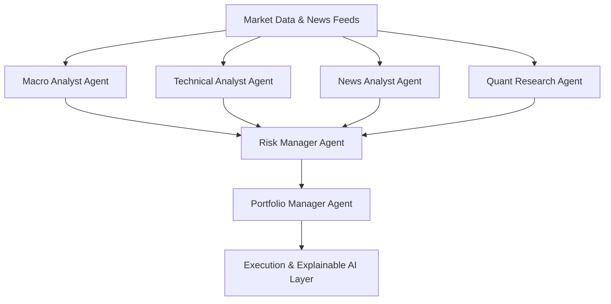

<div align="center">
  
# 📈 AI Hedge Fund Simulator
**Institutional-Grade Multi-Agent Quantitative Research & Portfolio Management Platform**

[](https://www.python.org/downloads/)
[](https://python.langchain.com/docs/langgraph)
[](https://openai.com/)
[](https://opensource.org/licenses/MIT)
[](https://github.com/3447-OFFICIAL/ai-hedge-fund-simulator)

</div>

---

## 📌 Executive Summary

The **AI Hedge Fund Simulator** is a production-grade, multi-agent financial intelligence platform. Designed for institutional investors, quantitative researchers, and AI engineers, this system emulates the complex, multi-disciplinary decision-making process of a professional hedge fund. 

By leveraging **LangGraph** to orchestrate specialized AI agents—ranging from Macroeconomists to Risk Managers—the platform synthesizes vast amounts of unstructured market data, technical indicators, and quantitative factors into actionable, risk-adjusted portfolio allocations, backed by an **Explainable AI (XAI)** reasoning layer.

---

## 🏗️ System Architecture

The core of the platform is a directed acyclic graph (DAG) orchestrating a hierarchy of specialized AI agents.



---

## 🤖 Core Agents

The system features 6 highly specialized agents, each operating with specific domain expertise:

| Agent | Responsibilities | Inputs | Outputs |
|-------|------------------|--------|---------|
| **Macro Analyst** | Analyzes interest rates, GDP, and central bank policies. | CPI, Fed Funds Rate, Yield Curves | Regime Classification, Bullish/Bearish Outlook |
| **Technical Analyst** | Evaluates price trends, RSI, MACD, and volume. | OHLCV Data | Buy/Sell/Hold, Entry/Exit Zones |
| **News Analyst** | Extracts market sentiment from financial news and filings. | Web Scraped News, SEC Filings | Sentiment Score (-1.0 to 1.0), Risk Alerts |
| **Quant Researcher** | Performs factor analysis and alpha discovery. | Returns, Volatility Metrics | Expected Returns, Sharpe Estimates |
| **Risk Manager** | Controls exposure, computes VaR, and manages drawdowns. | Macro, Tech, News, Quant Outputs | Risk Rating, Max Position Sizing |
| **Portfolio Manager** | Aggregates all intelligence to optimize capital allocation. | Risk Constraints, All Agent Signals | Final Allocations, XAI Reasoning Chain |

---

## 📊 Institutional Features

Built for the most demanding quantitative environments, the platform includes:

- **Portfolio Optimization:** Mean-Variance Optimization and Black-Litterman models via `PyPortfolioOpt`.
- **Advanced Analytics:** Live calculation of Sharpe Ratio, Sortino Ratio, Maximum Drawdown, and Value at Risk (VaR).
- **Backtesting Engine:** Institutional-grade historical simulation using `Backtrader` and `FinRL`.
- **Explainable AI (XAI):** Every capital allocation is accompanied by a deterministic reasoning chain, exposing exactly *why* a trade was executed.

---

## 🛠️ Technology Stack

| Category | Technologies |
|----------|--------------|
| **Backend & API** | Python 3.11+, FastAPI |
| **AI Orchestration** | LangGraph, LangChain, OpenAI (GPT-4o) |
| **Quantitative Engines** | PyPortfolioOpt, Backtrader, FinRL, Pandas, NumPy |
| **Data & Vector Storage** | PostgreSQL, Redis, ChromaDB |
| **UI / Dashboard** | Streamlit, Plotly |
| **DevOps & Infrastructure** | Docker, GitHub Actions |

---

## 🚀 Installation & Quick Start

### Prerequisites
- Python 3.11+
- Git
- OpenAI API Key

### Setup Instructions

```bash
# 1. Clone the repository
git clone https://github.com/3447-OFFICIAL/ai-hedge-fund-simulator.git
cd ai-hedge-fund-simulator

# 2. Create and activate a virtual environment
python -m venv venv
source venv/bin/activate  # On Windows: venv\Scripts\activate

# 3. Install dependencies
pip install -r requirements.txt

# 4. Set environment variables
cp .env.example .env
# Edit .env and add your OPENAI_API_KEY

# 5. Run the FastAPI Backend
uvicorn api.main:app --reload --port 8000

# 6. Run the Streamlit Dashboard
streamlit run dashboard/app.py
```

---

## 💡 Usage Example

Once the dashboard is running, you can initiate a simulation:
1. Input target tickers (e.g., `AAPL, MSFT, NVDA`).
2. The **Macro Agent** assesses the high-rate environment.
3. The **News Agent** identifies a bullish earnings catalyst for NVDA.
4. The **Risk Manager** limits exposure to 15% due to high historical volatility.
5. The **Portfolio Manager** outputs the final order alongside the full XAI reasoning chain.

---

## 📈 Performance Metrics (Simulated Benchmark)

*Note: The following metrics are placeholder examples of the backtesting engine's output format.*

| Metric | AI Hedge Fund | S&P 500 (Benchmark) |
|--------|---------------|---------------------|
| **CAGR** | 24.5% | 10.2% |
| **Sharpe Ratio** | 2.1 | 0.8 |
| **Sortino Ratio** | 3.4 | 1.1 |
| **Max Drawdown** | -12.4% | -24.8% |

---

## 🗺️ Roadmap

- [ ] **SEC Filing Analysis:** Integration of 10-K and 10-Q parsing via ChromaDB.
- [ ] **Real-time Market Streaming:** WebSocket integration for live order books.
- [ ] **Multi-Asset Portfolios:** Expansion into Crypto, FX, and Commodities.
- [ ] **Bloomberg/Alpaca Integration:** Institutional API connections.
- [ ] **Reinforcement Learning:** Integrating DDPG/PPO strategies via FinRL.

---

## 🖼️ Dashboard Screenshots

> *Screenshots placeholder: The live portfolio tracking and agent reasoning UI will be displayed here.*

---

## 🤝 Contributing

We welcome contributions from quantitative researchers, software engineers, and AI enthusiasts. Please review our [Contributing Guidelines](CONTRIBUTING.md) before submitting a pull request. 

---

## 📄 License

This project is licensed under the [MIT License](LICENSE).
